# Blogify: A Dynamic Blogging Platform with Django REST Framework and React

## Introduction

This project is a versatile and interactive blogging platform built using Django, a high-level Python web framework, for the backend, and React, a JavaScript library, for the frontend. It leverages Django REST Framework to provide API endpoints for communication between the frontend and backend. The platform enables users to create, publish, and manage their blogs, engage with other users through comments, likes, and follows, and submit inquiries through a contact form.

The live link for Blogify can be found [HERE](https://blog-pp5-28d8f080bed0.herokuapp.com/).

## Project Goals

The primary objective of this project is to develop a dynamic and user-centric blogging website, empowering individuals to create and manage their accounts and personalized profiles effortlessly. Upon registration, users gain immediate access to a feature-rich platform designed to facilitate seamless blogging experiences.

A key focus of our endeavor is to prioritize user experience, ensuring a transparent and intuitive interface that fosters ease of navigation and adoption. Through a meticulously crafted blog creation form, users can input their content details, including striking imagery, compelling titles, and categorization from a predefined list, with minimal friction.

In addition to facilitating personal expression, our platform serves as a vibrant community hub where users can engage with a diverse array of content curated by their peers. The ability to bookmark favorite blogs for later consumption and follow preferred bloggers fosters a sense of belonging and discovery within the community.

Furthermore, fostering meaningful interactions is paramount to our mission. Users are encouraged to share their thoughts and engage in discussions through comments, nurturing a culture of dialogue and collaboration. For any technical queries or support needs, a dedicated contact form ensures prompt assistance from our administrative team.

At its essence, this project is driven by a commitment to democratize content creation and knowledge-sharing, providing a platform for talented bloggers to showcase their expertise and connect with a global audience. Together, we embark on a journey of empowerment, creativity, and collective growth.

## User Experience

### Typography:

Font Selection:
For the blog project, a thoughtful combination of fonts is employed to enhance readability and aesthetic appeal. Headings (h1 to h6) are styled using the elegant 'Alice' font, providing a clean and modern look. Meanwhile, paragraphs and other text elements utilize a sans-serif fallback font to ensure consistency across different platforms and devices.

Font Sizes:
Font sizes are carefully chosen to establish a clear hierarchy and improve user experience. Headings are set to larger sizes to capture attention and guide readers through the content, while body text maintains a comfortable reading size for enhanced readability.

Imagery:
Images play a crucial role in complementing the textual content and engaging users visually. Within the blog, images are thoughtfully selected and optimized for web viewing, ensuring fast loading times and a seamless browsing experience.

Content Styling:
The blog's content is presented in a clean and organized manner, with each post displayed within a bordered container to distinguish it from the background. Titles are prominently displayed at the center of each post, styled in a bold font with a color palette that complements the overall design aesthetic.

Font Styles:
Typography choices, including font size and weight, are carefully curated to enhance the visual appeal of the blog. Titles feature a vibrant color (#DD7373) to draw attention, while other text elements maintain a consistent style for readability and coherence.

Card Styles:
Each blog post is encapsulated within a card-like container, providing a structured layout that enhances readability and visual appeal. Images within the cards are sized and positioned to maintain consistency and ensure optimal viewing across devices.

Interaction Styles:
Interactive elements, such as like buttons and hover effects, are implemented to enhance user engagement and interactivity. For example, the bookmark icon changes color on hover to provide visual feedback to users.

Scrollbar Styling:
To ensure a seamless browsing experience, scrollbar styling is applied to maintain consistency with the overall design aesthetic. This includes customizing the scrollbar's appearance and behavior to align with the project's visual identity.

### Color

Color Scheme:

Text color: #000 or #DD7373

Navbar background color: #ffffff

Button colors:

    Blue: Background color #397367, text color #ffffff

    BlueOutline: Background color #F9DB6D, text color #3C1518 (on hover: #3C1518)

    Black: Background color #242a3d, text color aliceblue

    BlackOutline: Background color aliceblue, text color #242a3d (on hover: #242a3d)

    Bright: Background color #397367, text color #F9DB6D

---
## Feature Overview

This section serves to articulate the user stories for the project. User stories represent a vital aspect of the software development process, capturing the requirements from the end-users' perspective. They effectively delineate the functionality and features of the system, aligning with the users' needs and expectations.

### Agile Methodology

The project adheres to Agile methodology, an iterative approach to software development that prioritizes collaboration, flexibility, and customer feedback. This methodology facilitates breaking down the development process into manageable increments, fostering continuous improvement and adaptability to evolving requirements.

#### Kanban Board

Employing a Kanban board, a visual management tool, enables efficient tracking and management of tasks as they progress through various stages of the development process. It provides stakeholders with a clear overview of tasks, their statuses, and identifies any potential bottlenecks in the workflow.

#### MoSCoW Prioritization

Utilizing MoSCoW prioritization aids in categorizing requirements into four distinct categories: Must have, Should have, Could have, and Won't have. This categorization ensures the prioritization of features and functionalities based on their significance and impact on the project's objectives.

#### Story Points

Story points serve as a unit of measure within Agile project management, offering an estimation of the complexity and effort required to complete a user story. This relative estimation facilitates effective planning and prioritization of tasks, contributing to the project's overall success.

### CRUD Functionality

The system seamlessly manages data with complete CRUD functionality:

- **Create**: Users are empowered to create various entities including accounts, profiles, tasks, comments, packs, contact messages, and watch objects, fostering engagement and interaction within the platform.

- **Read**: Users enjoy the ability to access a wide array of information, such as tasks, comments, and packs contributed by other users, as well as profiles of these users, facilitating comprehensive understanding and collaboration.

- **Update**: Users have the flexibility to update their profiles, passwords, posted tasks, packs, and watch status of tasks using intuitive and interactive forms and buttons seamlessly integrated into the site, ensuring up-to-date information and enhanced user control.

- **Delete**: Users maintain control over their content by being able to delete tasks, comments, packs, and watch objects with ease through interactive buttons on the site, enabling efficient management and organization of data.

### User Stories

1. **User Story: User Signup**  
   As a new user, I can signup to create an account and access the platform seamlessly.

2. **User Story: User Login**  
   As a registered user, I can log in to access personalized content and features effortlessly.

3. **User Story: View Blogs**  
   As a user, I can browse through blogs to explore content shared by other users conveniently.

4. **User Story: Create Blog**  
   As a logged-in user, I can create and publish new blog posts to share my thoughts and content with the community.

5. **User Story: Update/Edit Blog**  
   As a logged-in user, I can modify and update my own blog posts to ensure accuracy and relevance.

6. **User Story: Delete Blog**  
   As a logged-in user, I can delete my blog posts to manage content that is no longer pertinent or appropriate.

7. **User Story: Update Profile**  
   As a logged-in user, I can update my profile information to keep it accurate and up to date.

8. **User Story: Create Entry in Upcoming Blog Table**  
   As a logged-in user, I can contribute by creating entries in the upcoming blog table to participate in future content planning.

9. **User Story: Read Upcoming Blogs List**  
   As a user, I can access the list of upcoming blogs to stay informed about forthcoming content.

10. **User Story: Update/Edit Upcoming Blog Entry**  
    As a logged-in user, I can edit/update the entries I created in the upcoming blog table to ensure relevance and accuracy.

11. **User Story: Delete Upcoming Blog Entry**  
    As a logged-in user, I can remove entries I created in the upcoming blog table if they become outdated or irrelevant.

12. **User Story: Contact Admin**  
    As a logged-in user, I can initiate contact with the admin to seek assistance or resolve queries promptly.

13. **User Story: View Contact Tickets**  
    As a logged-in user, I can access and review my contact tickets along with their statuses and admin responses for effective communication management.

14. **User Story: Update/Edit Contact Ticket**  
    As a logged-in user, I can modify and update my contact tickets to provide additional information or address any changes in queries.

15. **User Story: Delete Contact Ticket**  
    As a logged-in user, I can delete contact tickets that are no longer relevant or needed to maintain organizational clarity.

16. **User Story: Updated Home Page**  
    As a user, I desire an updated home page featuring new featured blogs for enhanced content discovery and user engagement.

17. **User Story: Easy Functionality Access**  
    As a user, I expect seamless access to functionalities throughout the website to facilitate efficient navigation and usage.

18. **User Story: Create Comment**  
    As a logged-in user, I can engage with blog content by creating comments to share my thoughts and insights.

19. **User Story: Update/Edit Comment**  
    As a logged-in user, I can edit/update my comments to ensure accuracy and relevance within the context of blog discussions.

20. **User Story: Read Blog Comments**  
    As a user, I can peruse comments on blog posts to engage with discussions and gain additional insights into the content.

21. **User Story: Delete Comment**  
    As a logged-in user, I can delete my comments to manage contributions and maintain the integrity of discussions.

22. **User Story: View Other Bloggers**  
    As a user, I can discover and connect with other bloggers on the platform to explore diverse content and perspectives.

23. **User Story: Follow Blogger**  
    As a logged-in user, I can follow bloggers to receive updates and notifications about their new content and activities.

24. **User Story: Unfollow User**  
    As a logged-in user, I can unfollow other users to control the content and notifications I receive on the platform.

25. **User Story: Sign Out**  
    As a logged-in user, I can sign out securely to end my session and safeguard my account.

### Conclusion

The user stories outlined above provide a comprehensive blueprint of the project's functionalities and features, meticulously prioritized using MoSCoW prioritization. Throughout the project's lifecycle, Agile methodologies, including the use of a Kanban board and story points for estimation and planning, have been instrumental in ensuring the project's success and alignment with stakeholders' needs and expectations.

## Technology Stack

### Coding Languages

- HTML5
- CSS3
- JavaScript

### Frameworks and Tools

#### JavaScript Libraries/Frameworks
- **React (17.0.2)**: A JavaScript library for building user interfaces, utilized for its efficiency and versatility in creating interactive components.

#### CSS Frameworks
- **React-Bootstrap (1.6.3)**: A CSS framework built with React components, offering pre-designed UI elements and responsive layout features for streamlined development.

#### API Integration
- **Axios**: A Promise-based HTTP client for making API requests, chosen for its ease of use and compatibility with modern web applications.

#### Authentication and Security
- **JWT (JSON Web Tokens)**: A library for encoding and decoding JSON web tokens, employed to securely transmit data and verify content integrity.

#### Routing
- **React Router (5.3.0)**: A JavaScript library for declarative routing in React applications, facilitating seamless navigation between views and efficient URL-based rendering.

#### UI Components and Visualization
- **React ChartJS2 (3.0.4)**: A React wrapper for Chart.js, utilized for creating dynamic and visually appealing data visualizations such as the doughnut chart featured on the main page.
- **React Infinite Scroll (6.1.0)**: A React library enabling infinite scrolling functionality, enhancing user experience by loading content dynamically as the user scrolls.
- **React Multi Select Component (4.3.4)**: A React component for creating multi-select dropdowns, providing users with the ability to select and manage multiple tasks efficiently.

#### Development and Debugging Tools
- **Chrome Dev Tools**: A set of web developer tools built into the Google Chrome browser, utilized for debugging code and testing site responsiveness.

#### Version Control and Collaboration
- **Git and GitHub**: Version control system and cloud-based hosting service, employed for managing project versions and facilitating collaborative development.

#### Design and Mockup Tools
- **Balsamiq**: A wireframing tool for creating mockups and prototypes, utilized for designing the project's wireframes.
- **Affinity Designer**: A professional graphic design software, used for creating custom graphics and images such as the 404 and no search results images.

#### Accessibility and Validation Tools
- **WC3 Validator**: HTML validator for ensuring compliance with web standards.
- **Jigsaw W3 Validator**: CSS validator for checking the validity of CSS code.
- **ESLint**: JavaScript validator for identifying and fixing syntax errors and coding conventions.
- **Lighthouse**: A site auditing tool for evaluating performance, accessibility, best practices, and SEO of the application.
- **Wave**: A web accessibility evaluation tool for assessing the accessibility of the application and ensuring inclusivity.

### Libraries

### Installed Libraries

| Package                      | Version |
| ---------------------------- | ------- |
| @testing-library/jest-dom    | 5.14.1  |
| @testing-library/react       | 11.2.7  |
| @testing-library/user-event | 12.8.3  |
| axios                        | 0.21.4  |
| bootstrap                    | 4.6.0   |
| formik                       | 2.4.5   |
| jwt-decode                   | 4.0.0   |
| moment                       | 2.30.1  |
| react                        | 17.0.2  |
| react-bootstrap              | 1.6.3   |
| react-dom                    | 17.0.2  |
| react-infinite-scroll-component | 6.1.0   |
| react-router-dom             | 5.3.0   |
| react-scripts                | 4.0.3   |
| react-slick                  | 0.30.1  |
| reactstrap                   | 9.2.2   |
| slick-carousel               | 1.8.1   |
| web-vitals                   | 1.1.2   |
| yup                          | 1.3.3   |

### Front-End Development Overview

#### React.js

React.js, an open-source JavaScript library developed by Jordan Walke at Meta, stands as a prominent framework for constructing interactive user interfaces and web applications with remarkable efficiency and reduced code footprint compared to vanilla JavaScript.

##### Key Reasons for Utilizing React:

- **Flexibility**: React's modular structure fosters code maintenance, ensuring ease of maintenance compared to alternative front-end frameworks.
  
- **Performance**: Leveraging React enhances page loading speed by facilitating dynamic component updates without requiring a full page reload. This approach minimizes wait times, optimizing user experience.
  
- **React Bootstrap**: The integration of React Bootstrap streamlines styling and responsiveness by offering pre-built React components, diminishing the need for extensive custom code development.

- **Industry Adoption**: Renowned platforms like Meta (formerly Facebook), Instagram, Netflix, and Airbnb rely on React, solidifying its status as a go-to library for developing social networking and media content applications.

- **Component Reusability**: React promotes component-based development, facilitating the creation and reuse of modular components across the application, thereby enhancing development efficiency and consistency.

##### Notable Components Developed:

- `<Asset />`: A versatile component utilized for displaying a range of items based on passed props, including loading gifs, images, or messages. Utilized in various user stories.
  
- `<Avatar />`: A reusable component responsible for displaying user profile pictures, offering flexibility in image source and size. Employed in user story 18.
  
- `<DropDown />`: A reusable component displaying context-specific options based on user rights and item context, enhancing interface interactivity across multiple user stories.
  
- `<NavBar />`: A reusable navigation component providing seamless site navigation, dynamically adjusting icon display based on user login status.

##### Page Groupings:

- **Auth**: Responsible for handling login and signup functionality.

- **Blogs**: Manages the creation, editing, display, and deletion of blogs.

- **Comments**: Handles the creation, editing, display, and deletion of comments.

- **Contact**: Facilitates user interaction via contact forms.

- **Home**: Displays featured blogs and important functionalities.

- **NotFoundPage**: Presents a stylish 404 Not Found page.

- **Dashboard**: Presents the main page for authenticated users.

- **Landing**: Serves as the main page for anonymous users.

- **Profiles**: Manages user profile-related functionality, including editing and display.

- **Upcoming Blogs**: Handles the creation, editing, display, and deletion of the upcoming blogs table.

### Back-End API

#### Django REST Framework

The Back-End API for this Front-End application was developed using the Django REST Framework (DRF), a powerful toolkit for building Web APIs in Python. For detailed information and access to the DRF Back-End repository, please refer to [this link](https://github.com/zeeshan-shah/pp5-api/).

## Features

### Architecture

The website's architecture is meticulously structured to accommodate both authenticated and non-authenticated users, ensuring a seamless experience for all visitors. The user journey is delineated as follows:

### Authentication Workflow:
- **Registration:** Users can create an account seamlessly through the Register page.
- **Login:** Existing users gain access to their accounts using their designated username and password via the Login page.

### Homepage Navigation:
- The Home page is accessible to all visitors, with certain features exclusively available to authenticated users.

### Authenticated User Capabilities:
- **Follower Management:** Authenticated users can effortlessly follow/unfollow profiles of interest, fostering community engagement.
- **Navigation Bar:** Specific elements like "Sign up" and "Sign in" are discreetly hidden for authenticated users, ensuring a clutter-free interface.
- **Profile Management:** Authenticated users enjoy personalized features such as profile name and avatar display in the navigation bar, facilitating intuitive navigation within the platform.
- **Blog Management:** Users can contribute to the platform by adding, editing, or deleting their blogs.
- **Commenting:** Engage in meaningful discussions by commenting on blogs.
- **Bookmarking:** Authenticated users have the privilege to bookmark blogs for convenient reference.
- **Blog Creation:** Authenticated users can create both regular and upcoming blog posts, enriching the platform's content diversity.
- **Profile Editing:** Customize profiles to add a personal touch to their online presence.

### Authentication-Specific Features:
- **Blog Creation:** Exclusive to authenticated users.
- **Blog Modification and Deletion:** Reserved for the creators of the blogs.
- **Information Creation:** Available only to authenticated users.
- **Information Modification and Deletion:** Accessible solely to the creators of the information.
- **Contact Form Submission:** Restricted to authenticated users.
- **Contact Ticket Editing and Deletion:** Permissible only for the creators of the tickets.
- **Commenting on Blogs:** Limited to authenticated users.
- **Comment Modification and Deletion:** Exclusive to the creators of the comments.

#### Wireframes

The conceptualization and design process of the website commenced with meticulous planning, both on paper and through the utilization of online tools such as [Figma](https://www.figma.com/). These wireframes served as foundational blueprints, aiding in the visualization and structuring of the project's framework. It's imperative to note that while these wireframes provide a structured outline, they do not represent the final rendition of the website.

Throughout the design phase, extensive consideration was given to various aspects including user experience, interface elements, and navigational flow. The wireframes served as a dynamic tool, allowing for iterative refinement and adaptation as the project progressed.

Attached below are snapshots of the website's design evolution captured during the wireframing process:

  
Home page:

  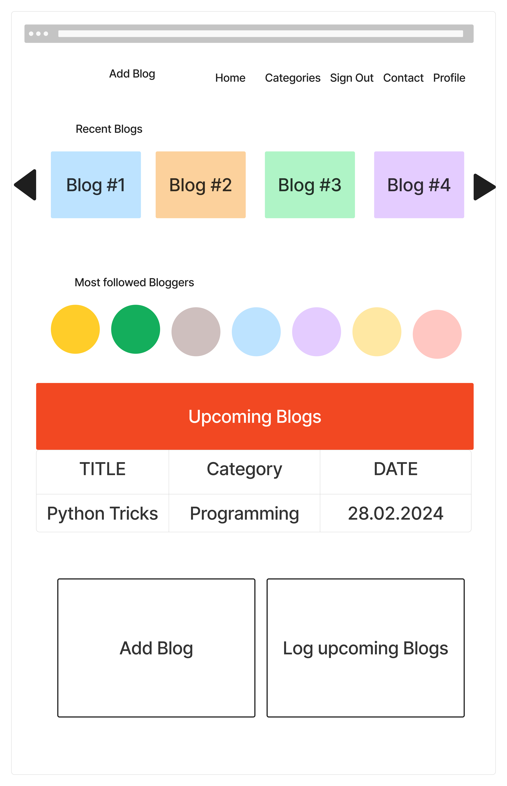

  
Blog Categories:

  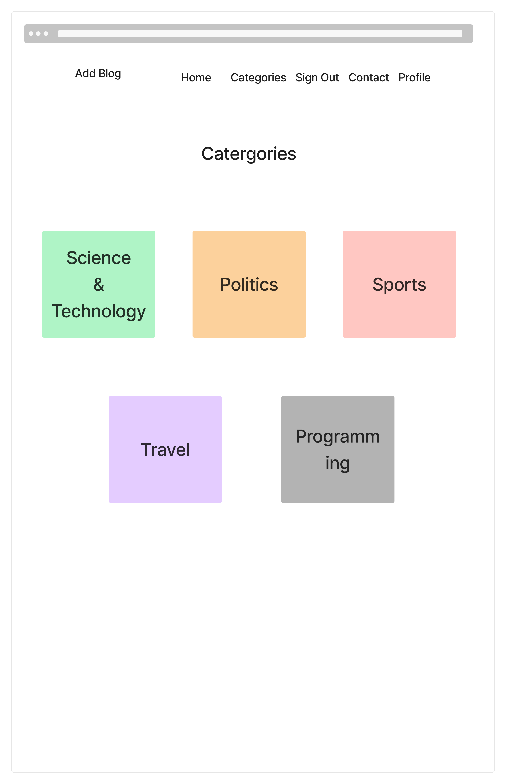

  
Blog page of certain category:

  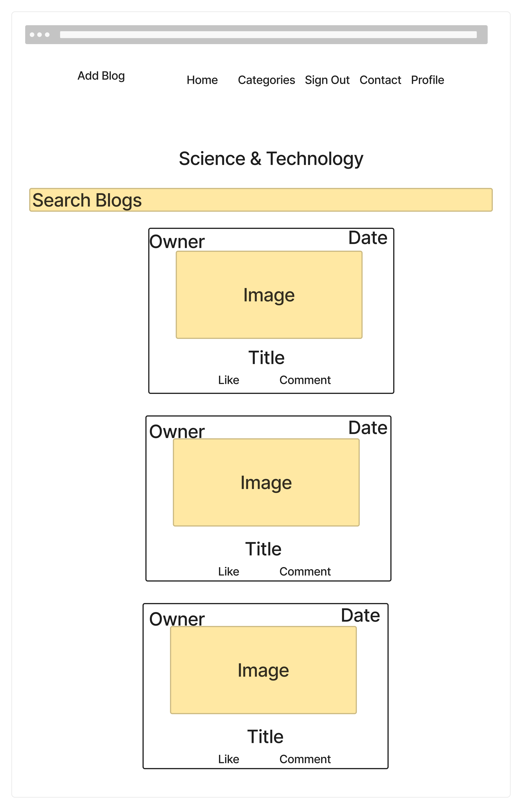

  
Blog details:

  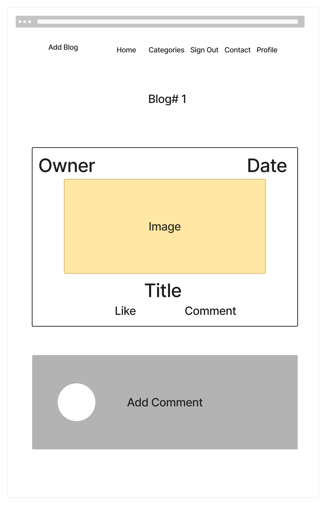

  
Contact:

  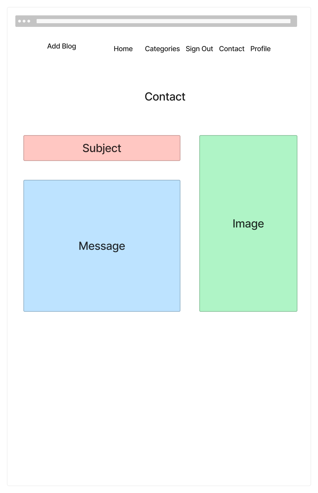

These wireframes encapsulate the initial stages of the website's development journey, providing a visual roadmap for the implementation and refinement phases. As the project advances, these wireframes will evolve into fully-fledged interfaces, embodying the envisioned user experience and functionality.

---

## Key Components

Header and Navigation

The navigation bar remains visible across the entire application, providing seamless access to various functionalities. However, the elements displayed may vary based on the user's authentication status. The "Home" button and the application name and logo remain consistent regardless of login status.

#### Navigation Bar for Logged-In User:

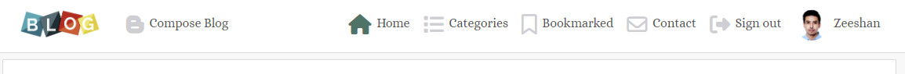

#### Navigation Bar for Logged-Out User:

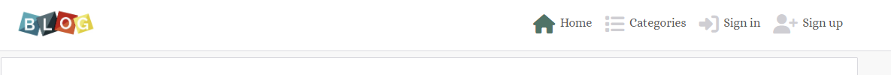

Sign Up

The "Sign Up" navigation button is prominently displayed for users who are not logged in. This page facilitates the creation of a new account, allowing users to set up their unique username and password to unlock the full functionality of the application. Notably, the layout may differ between mobile and desktop views, with the image feature exclusively available in desktop mode. The sign-up process is also user-friendly and includes a form for users to provide their username and password, with confirmation. If there are no errors in the input fields, the sign-up will be successful, and the user will be redirected to the sign-in page. Otherwise, they will be shown error messages on the screen to correct them.

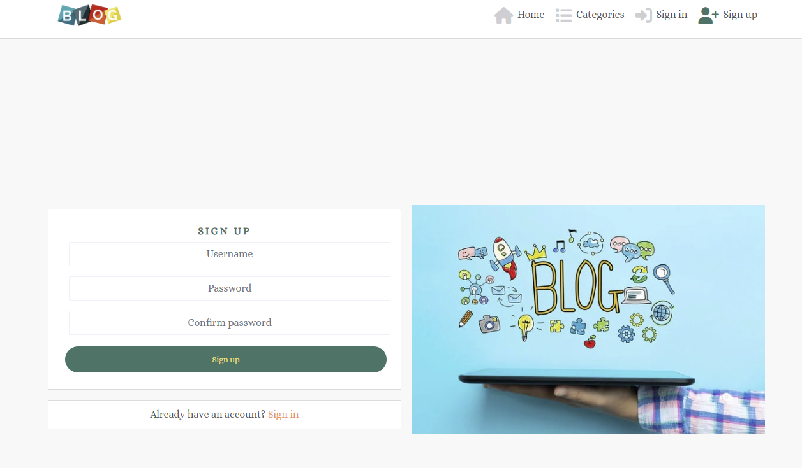

Sign In

Similar to the "Sign Up" option, the "Sign In" navigation button is visible exclusively to logged-out users. This page enables users to securely log into the application using their existing credentials. The presence of an image feature is exclusive to the desktop view.

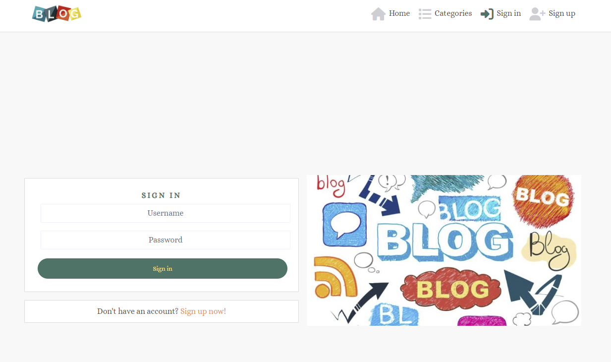

Create Blog Page

The "Compose Blog" page empowers users to share their content by uploading images and providing essential details such as title, category, and content information. This comprehensive approach enhances the visibility and searchability of user-generated blogs, fostering a more informative user experience.

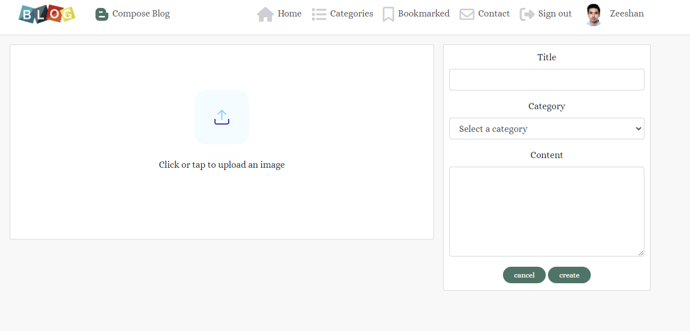

Upcoming Blog Creation Page

The "Upcoming Blog Creation" page allows authenticated users to share important upcoming events or announcements with other members of the community. These blogs, once created, are displayed prominently, and if the end date has elapsed, they are automatically removed from the database. Administrators retain the authority to edit or delete any information blogs via the Admin panel.

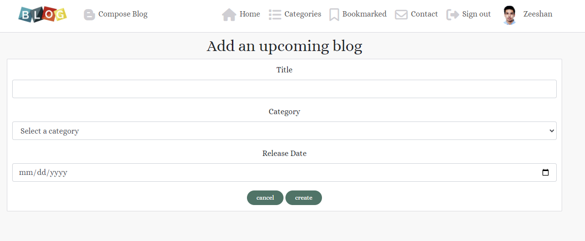

Blog Page

Individual blog blogs offer interactive features such as liking and commenting. While blog owners cannot like their own content, they retain the ability to edit or delete their blogs. Commenters are differentiated by color coding, with the blog owner's comments highlighted in green for easier identification. Administrators hold the privilege to manage blogs and comments through the Admin panel.

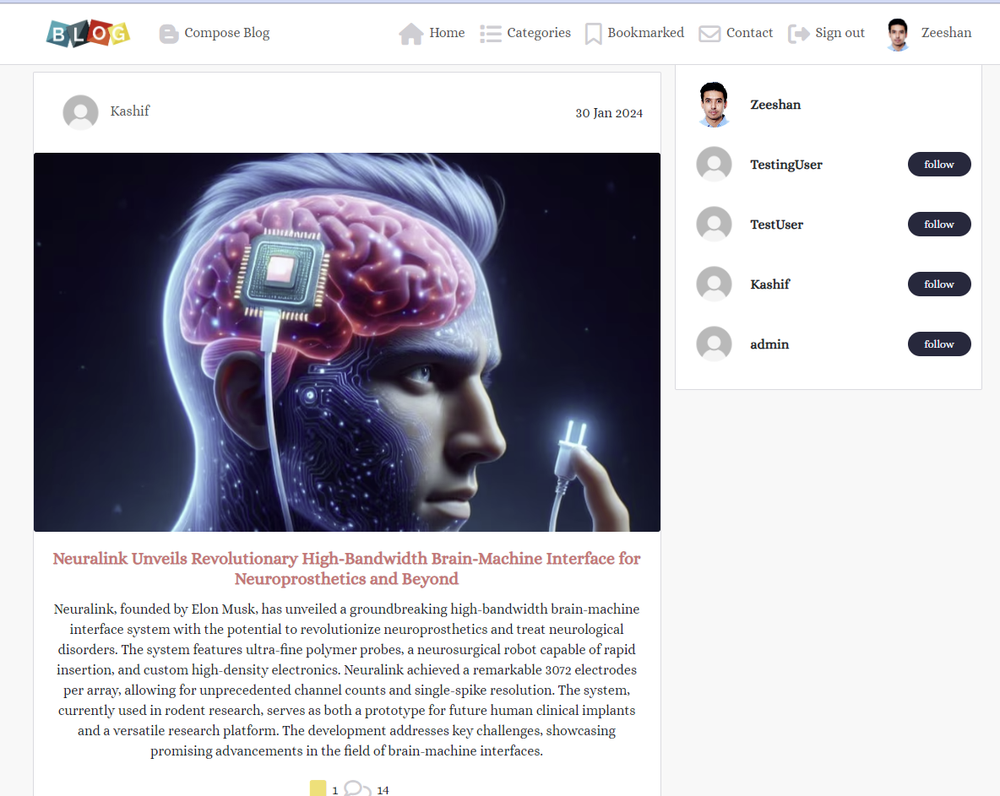

Contact Page

The "Contact" page serves as a platform for users to submit queries or feedback. Upon successful submission, users can conveniently manage their tickets, including viewing, editing, or deleting them, via their profile page. Administrators possess comprehensive control over tickets, enabling them to respond, delete, or create new tickets via the Admin panel.

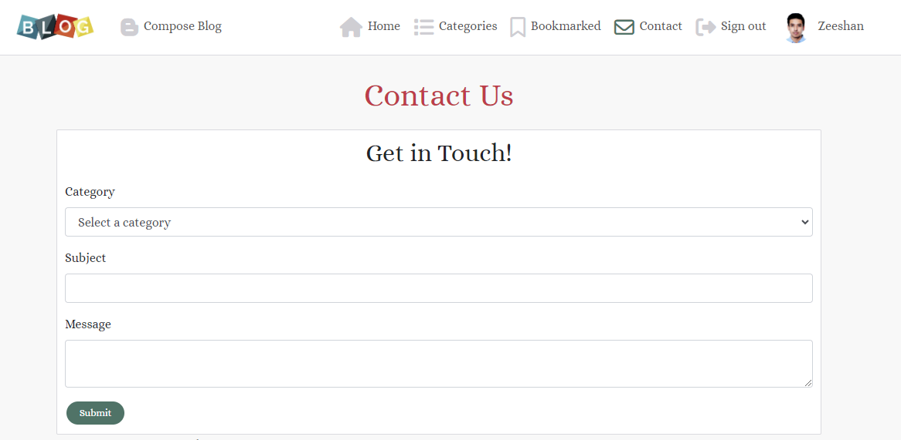

Profile Page

The profile page offers users an overview of their tickets, along with options to edit their profiles, change usernames, or passwords. Additionally, for profiles not owned by the user, an "Unsubscribe" button is provided. Administrators can efficiently manage tickets through the Admin panel, facilitating seamless communication and support within the platform.

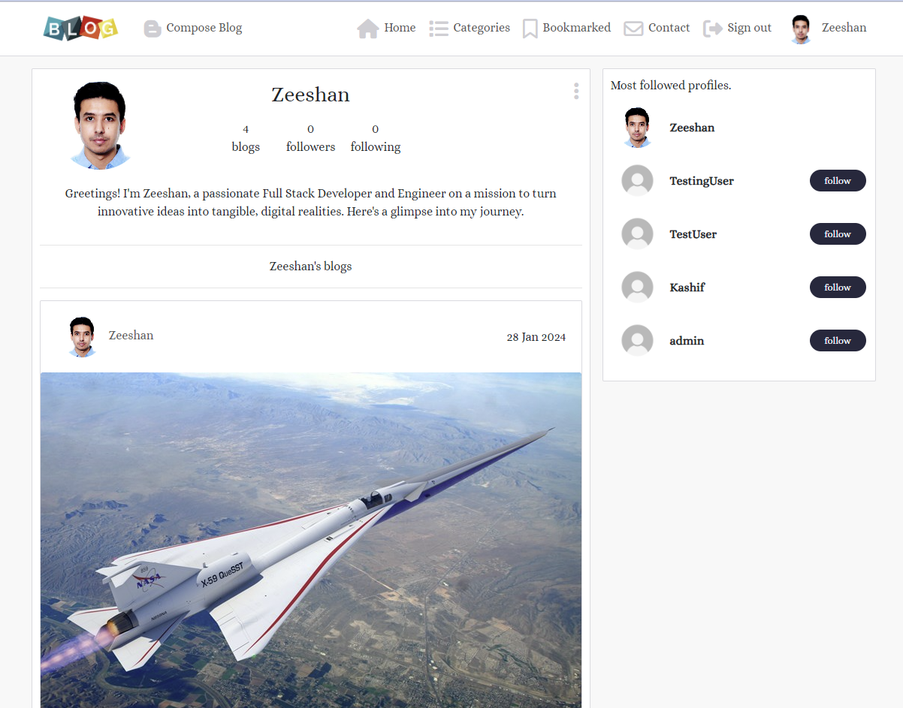

--- 

## Validation

### CSS Validation

The project's CSS files undergo validation using the [Jigsaw W3 CSS Validator](https://jigsaw.w3.org/css-validator/), ensuring adherence to industry standards and best practices. The validation process confirms the absence of errors and verifies the integrity of the CSS codebase.

Validator Result

#### CSS Validation

The validation report confirms the compliance of the CSS files with W3C standards, affirming their syntactic correctness and structural integrity.

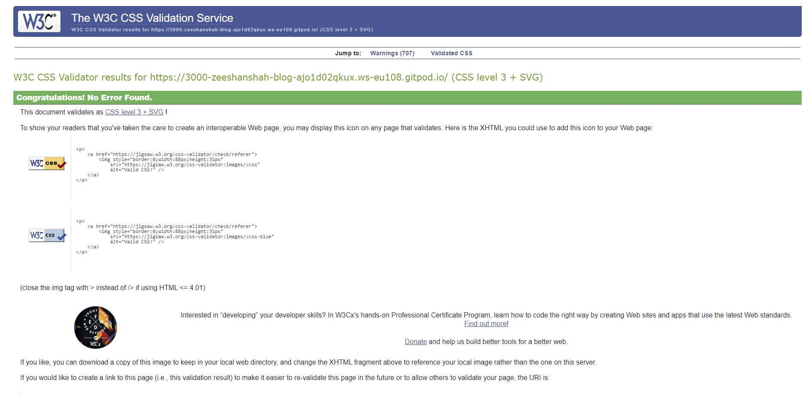

For further details, you can visit the [Jigsaw W3 CSS Validator](https://jigsaw.w3.org/css-validator/) website.

This rigorous validation process contributes to the overall robustness and reliability of the project's front-end design, enhancing user experience and ensuring consistent rendering across different browsers and devices.

### HTML Validation

The project's HTML code undergoes meticulous validation using the [W3C validator](https://validator.w3.org/), ensuring adherence to established standards and conventions. The validation process aims to identify and rectify any potential errors or inconsistencies in the HTML markup.

Validator Result

#### HTML Validation

The validation report from the W3C validator confirms the structural integrity and syntactic correctness of the HTML codebase. While no errors are detected, there are minor warnings regarding the trailing slash on void elements, which are considered acceptable and do not impact the functionality or presentation of the website.

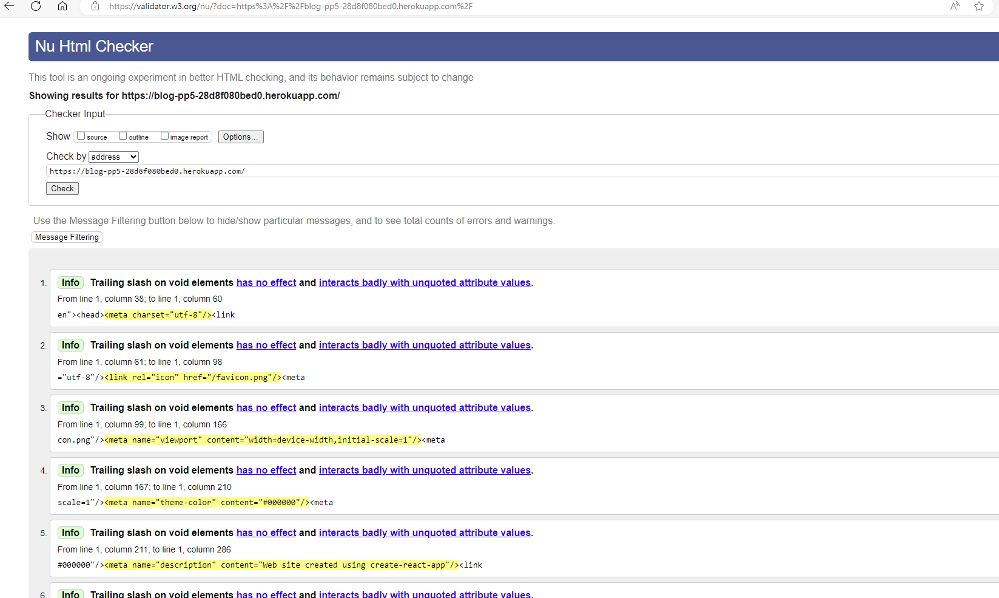
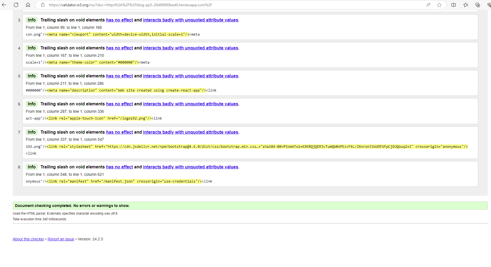

For further validation, you can visit the [W3C HTML Validator](https://validator.w3.org/) website.

This rigorous validation process ensures the compliance of the project's HTML markup with industry standards, facilitating optimal performance, accessibility, and compatibility across various browsers and devices.

### Lighthouse Results

The project undergoes comprehensive evaluation using Lighthouse, a tool that assesses various aspects including performance, accessibility, progressive web apps, and SEO analysis. Below are the detailed results obtained from Lighthouse testing:

Click to Expand

#### Lighthouse Test Results

##### Homepage

View Lighthouse Test Results

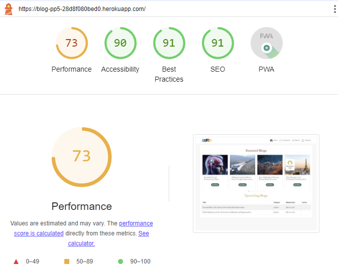

##### Blog Compose Page

View Lighthouse Test Results

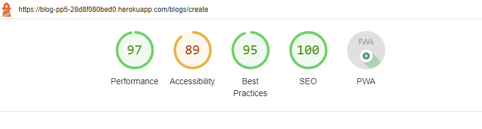

##### Blog Science Page

View Lighthouse Test Results

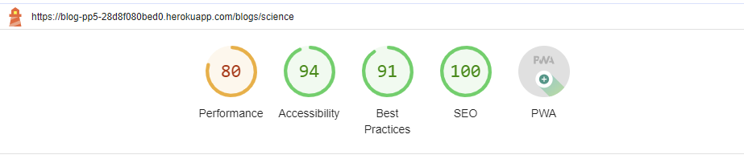

##### Bookmark Page

View Lighthouse Test Results

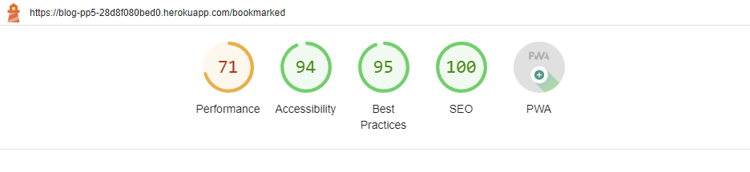

##### Category Page

View Lighthouse Test Results

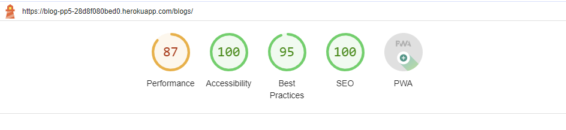

##### Contact Page

View Lighthouse Test Results

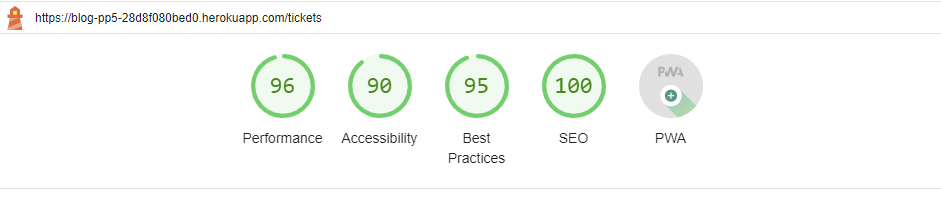

##### Signin Page

View Lighthouse Test Results

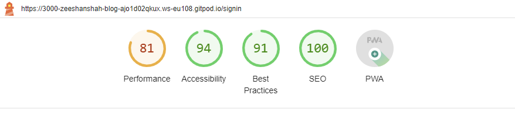

##### Signup Page

View Lighthouse Test Results

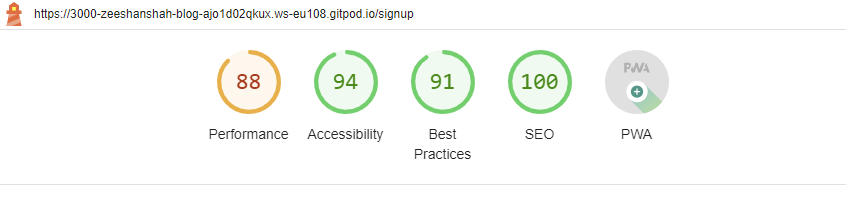

##### Upcoming Blogs Page

View Lighthouse Test Results

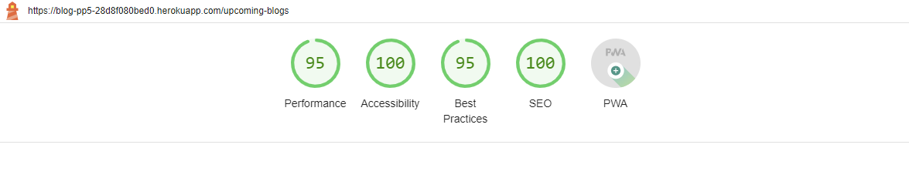

### Note

While conducting Lighthouse validation, it's important to acknowledge certain factors that may affect the consistency and accuracy of the results:

- **Test Scope:** Lighthouse validation was focused on various pages such as the homepage, blog pages, bookmark page, category page, contact page, signin page, signup page, and upcoming blogs page.

- **Inconsistent Results:** The performance of the project may vary due to factors such as user-uploaded images and hosting environment. Hosting the project on Heroku may impact server response time, caching, and network latency. Additionally, the use of external libraries may affect the website's response. Efforts will be made in future projects to optimize and improve these metrics for enhanced user experience.

#### ESLint Validation

ESLint, a popular JavaScript linter, was utilized to ensure code consistency and identify potential issues in the project's JavaScript files. The validation process revealed no errors.

View ESLint Results

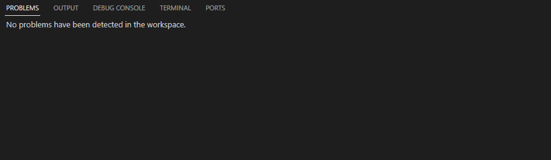

### Explanation

The installation of ESLint's extension on Gitpod facilitated the validation process. Through meticulous examination of all project files, no errors were detected, indicating adherence to coding standards and best practices.

---

## Testing 

# Testing of User Stories for the Project

All User Stories can be found [Here](https://github.com/users/zeeshan-shah/projects/5)

## 1. EPIC: User Authorization

| **ID** | **User Story** | **As a...** | **Action/Expected Result** | **Pass/Fail** |
|--------|----------------|-------------|-----------------------------|---------------|
|   1    | New account registration. | As a new user, I can sign up so that I can create an account and access the platform. | As a non-registered user, I visit the site: `https://blog-pp5-28d8f080bed0.herokuapp.com/signup`, provide a unique username, and set a password. | :heavy_check_mark: |
|   2    | User login | As a registered user, I can log in to my account so that I can access my personalized content and features. | As a registered user, I visit the site: `https://blog-pp5-28d8f080bed0.herokuapp.com/signin` and provide my username and password to authenticate. | :heavy_check_mark: |
|   25   | Sign Out | As a logged-in user, I can sign out successfully so that I can securely end my session and protect my account. | As a logged-in user, I click on the `Sign Out` button in the navigation bar to log out. | :heavy_check_mark: |

## 2. EPIC: Blogs

| **ID** | **User Story** | **As a...** | **Action/Expected Result** | **Pass/Fail** |
|--------|----------------|-------------|-----------------------------|---------------|
|   3    | View a blog | As a user, I can view the blogs so that I can read the content shared by other users. | As a user, I visit `https://blog-pp5-28d8f080bed0.herokuapp.com/blogs/` through the `Categories` navigation item in the navigation bar to see the categories of the available blogs and select my desired category to view the blogs of that specific category. | :heavy_check_mark: |
|   4    | Create a blog | As a user, I can create a blog so that I can share content with other users. | As a logged-in user, I can click the `Compose Blog` button in the Navigation bar or go to `https://blog-pp5-28d8f080bed0.herokuapp.com/blogs/create` to create a new blog. | :heavy_check_mark: |
|   5    | Edit my blogs | As a logged-in user, I can update/edit my own blogs so that I can make changes or corrections to my published content. | As the owner of a blog, I can edit it anytime by opening the blog, clicking on the dropdown button on the top right side of the blog, clicking on the edit icon, and then making changes and updating the blog. | :heavy_check_mark: |
|   6    | Delete my blogs | As a logged-in user, I can delete my blogs so that I can remove content that is no longer relevant or appropriate. | As the owner of a blog, I can delete my blogs at any time by clicking the dropdown icon on the blog, clicking on the delete icon, and confirming the deletion. | :heavy_check_mark: |

## 3. EPIC: Profile

| **ID** | **User Story** | **As a...** | **Action/Expected Result** | **Pass/Fail** |
|--------|----------------|-------------|-----------------------------|---------------|
|   7    | Update Profile | As a logged-in user, I can update my profile data so that I can keep my account information accurate and up to date. | As a logged-in user, I can go to my profile by clicking my name on the top right side of the navigation bar, then click on the dropdown icon, and select the `Edit Profile` option. After making the necessary changes, I can update my profile. | :heavy_check_mark: |
|   22   | View Other Bloggers | As a user, I can see the other bloggers on the website so that I can discover and connect with other users. | As a user, I can visit profiles of other bloggers by clicking on their names on the right side of the pages in the most followed bloggers section. | :heavy_check_mark: |
|   23   | Follow Blogger | As a logged-in user, I can follow a blogger so that I can receive updates and notifications about their new content. | As a logged-in user, I can follow the profiles of other bloggers by clicking the `follow` button on their profiles. | :heavy_check_mark: |
|   24   | Unfollow Blogger | As a logged-in user, I can unfollow a user so that I can stop receiving updates and notifications about their content. | As a logged-in user, I can unfollow the profiles of other bloggers by clicking the `unfollow` button on their profiles. | :heavy_check_mark: |

## 4. EPIC: Upcoming Blogs

| **ID** | **User Story** | **As a...** | **Action/Expected Result** | **Pass/Fail** |
|--------|----------------|-------------|-----------------------------|---------------|
|   8    | Create a new upcoming blog | As a logged-in user, I can create a new entry in the upcoming blog table so that I can contribute to future content planning. | As a logged-in user, I can create an upcoming blog entry by clicking the `Create Upcoming Blog` button on the homepage or visiting `https://blog-pp5-28d8f080bed0.herokuapp.com/upcoming-blogs/create`. | :heavy_check_mark: |
|   9    | View upcoming blogs list | As a user, I can read the list of upcoming blogs so that I can stay informed about upcoming content. | As a user, I can see the list of upcoming blogs on the homepage under the featured blogs section. | :heavy_check_mark: |
|  10    | Edit my upcoming blog entry | As a logged-in user, I can update/edit the entry that I created in the upcoming blog so that I can make changes or corrections to my planned content. | As the creator of the upcoming blog entry, I can edit the item by clicking the `edit` button shown in the upcoming blog table under the `action` column, make changes, and update it. | :heavy_check_mark: |
|  11    | Delete my upcoming blog entry | As a logged-in user, I can delete my entry in the upcoming blog table so that I can remove content that is no longer relevant or appropriate. | As the creator of the upcoming blog entry, I can delete the item by clicking the `delete` button shown in the upcoming blog table under the `action` column and confirming the deletion. | :heavy_check_mark: |

## 5. EPIC: Contact Admin

| **ID** | **User Story** | **As a...** | **Action/Expected Result** | **Pass/Fail** |
|--------|----------------|-------------|-----------------------------|---------------|
|   12   | Contact with admin | As a logged-in user, I can contact the admin for any query so that I can seek assistance or information as needed. | As a logged-in user, I can click on the `Contact` button in the navigation bar, fill out the contact form, and click `submit`. The generated ticket will be shown in the table below the contact form. | :heavy_check_mark: |
|   13   | View tickets | As a logged-in user, I can see my contact tickets, their status, and admin responses so that I can track the progress of my inquiries. | As a logged-in user, I can check my contact tickets by clicking on the `Contact` button in the navigation bar or visiting `https://blog-pp5-28d8f080bed0.herokuapp.com/tickets`. The contact tickets will be shown in the `Contact Tickets` table below the contact form. | :heavy_check_mark: |
|   14   | Edit tickets | As a logged-in user, I can update/edit my contact ticket so that I can provide additional information or make changes to my inquiries. | As a logged-in user, I can edit my contact tickets by clicking on the `edit` button on the relevant ticket in the contact ticket table on `https://blog-pp5-28d8f080bed0.herokuapp.com/tickets`, update the desired data, and click the `update` button to make the update. The updated contact ticket will be shown in the `Contact Tickets` table below the contact form. | :heavy_check_mark: |
|   15   | Delete tickets | As a logged-in user, I can delete my ticket so that I can remove inquiries that are no longer needed or relevant. | As a logged-in user, I can delete my contact tickets by clicking on the `delete` button on the relevant ticket in the contact ticket table on `https://blog-pp5-28d8f080bed0.herokuapp.com/tickets` and confirm the deletion. The deleted contact ticket will be removed from the `Contact Tickets` table. | :heavy_check_mark: |

## 6. EPIC: Homepage

| **ID** | **User Story** | **As a...** | **Action/Expected Result** | **Pass/Fail** |
|--------|----------------|-------------|-----------------------------|---------------|
|   16   | Homepage | As a user, I want an updated home page where I can see new featured blogs so that I can discover new content easily. | As a user, I can view the featured blogs on the homepage, which motivates me to register myself on the website. | :heavy_check_mark: |
|   17   | Easy Functionality Access | As a user, I can access functionality easily throughout the website so that I can navigate and use the platform efficiently. | As a user, I can easily access and navigate anywhere on the site. There are buttons such as `Compose Blog`, `Create Upcoming Blog`, and buttons on the navigation bar such as `Contact`, `Categories`, and `Profile [Username]`, making the homepage the center of all functions. | :heavy_check_mark: |

## 7. EPIC: Comment

| **ID** | **User Story** | **As a...** | **Action/Expected Result** | **Pass/Fail** |
|--------|----------------|-------------|-----------------------------|---------------|
|   18   | Create Comment | As a logged-in user, I can create a comment on a blog so that I can engage with the content and share my thoughts. | As a logged-in user, I can write comments by simply clicking on the `message` icon under the blog, write the comment in the comment box, and then click on `post` to submit the comment. | :heavy_check_mark: |
|   19   | Edit Comment | As a logged-in user, I can edit/update my comment so that I can correct any mistakes or modify my contribution. | As a logged-in user, I can easily edit my comments by clicking the dropdown icon on the right side of the comment, selecting the edit button, making changes, and updating the comment. | :heavy_check_mark: |
|   20   | Read Blog Comments | As a user, I can read the comments on a blog so that I can see the discussions and interactions related to the content. | As a user, I can read comments on the blogs by simply opening a blog and scrolling down to the comment section. | :heavy_check_mark: |
|   21   | Delete Comment | As a logged-in user, I can delete my comments so that I can remove contributions that are no longer needed or appropriate. | As a logged-in user, I can easily delete my comments by clicking the dropdown icon on the right side of the comment, selecting the delete button, and confirming deletion. | :heavy_check_mark: |

## 8. EPIC: Bookmarking

| **ID** | **User Story** | **As a...** | **Action/Expected Result** | **Pass/Fail** |
|--------|----------------|-------------|-----------------------------|---------------|
|   26   | Bookmarking Blogs | As a user, I can bookmark other users' blogs so that I can save them for reading later. | As a logged-in user, I can bookmark blogs by clicking the `Bookmark` icon under the blog. | :heavy_check_mark: |
|   27   | Viewing Bookmarked Blogs | As a user, I can view the list of all my bookmarked blogs so that I can easily access them when I want to read them. | As a logged-in user, I can easily access my bookmarked blogs by clicking the `Bookmarked` button in the navigation bar. | :heavy_check_mark: |
|   28   | Removing Bookmarks | As a user, I can remove a bookmark from a blog that I've previously saved so that I can manage my list of bookmarked blogs and remove unwanted ones. | As a logged-in user, I can un-bookmark blogs by simply clicking the `Bookmark` icon again on the bookmarked blog. | :heavy_check_mark: |

## 9. EPIC: Advertisement

| **ID** | **User Story** | **As a...** | **Action/Expected Result** | **Pass/Fail** |
|--------|----------------|-------------|-----------------------------|---------------|
|   29   | Contact Admin for Ad Queries | As a logged-in user, I can contact the admin for advertisement queries so that I can get information or assistance regarding ads. | As a logged-in user, I can contact the admin regarding advertisement queries via the contact form. I choose `Advertise With Us` in the category of the contact form or click on the `Contact Us` button in the advertisement banner. | :heavy_check_mark: |

## Deployment

### Deploying the Website to Heroku

Before deploying to Heroku, ensure the following steps are completed:

- Create a `Procfile`: This file is crucial for deployment and must be named with a capital "P".

View Procfile

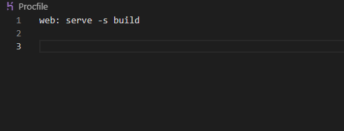

#### Steps to Deploy:

1. **Login or Create an Account at Heroku**:
   - Visit the Heroku website and either log in or create a new account.

2. **Creating an App**:
   - Click on "New" and then "Create new app".
   - Provide an app name and select a region.
   - Click "Create app".

    
Create App

    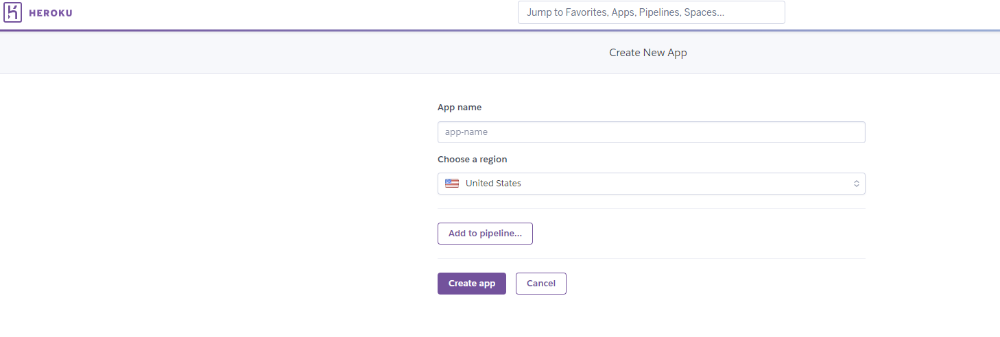

3. **Configure Environment Variables**:
   - Navigate to the settings tab and click on "Config vars".
   - Add necessary environment variables if required.

4. **Add Buildpacks**:
   - Open the settings tab and select the "Buildpacks" section.
   - Add the Node.js buildpack.

5. **Deploy from GitHub**:
   - In the deploy tab, choose the deployment method as GitHub.
   - Connect your GitHub account and select the repository.
   - Choose whether to enable automatic or manual deploys.

    
Deployment method

    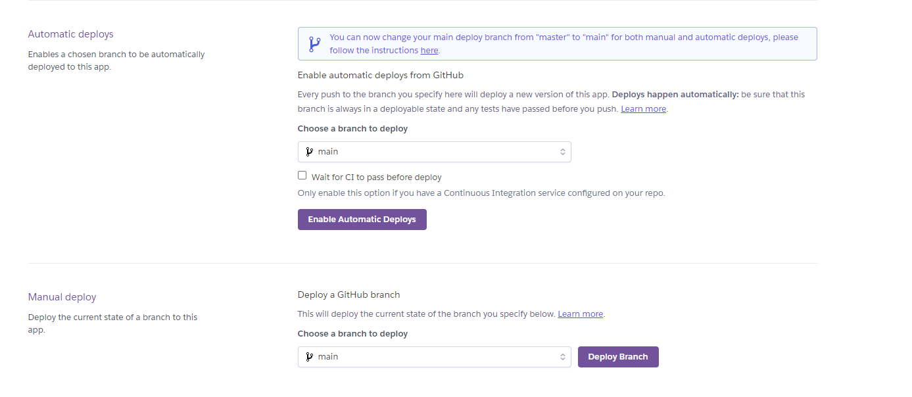

6. **Deployment**:
   - Click on the "Deploy" button to deploy the project to Heroku.

### Forking the GitHub Repository

1. Go to the GitHub repository.
2. Click on the "Fork" button in the top right corner.
3. The repository will be forked to your GitHub account.
4. [GitHub Repository](https://github.com/zeeshan-shah/blog)

### Cloning the Repository from GitHub

1. Visit the GitHub page of the website's repository.
2. Click the “Clone” button and copy the URL.
3. Open your IDE and run `git clone <copied URL>` in the terminal.

---
## Credits

- The code for this project was written with the guidance of Code Institute's walkthrough project [drf-api](https://github.com/Code-Institute-Solutions/drf-api).

- [GitHub](https://github.com/): I drew inspiration for the project's design from GitHub.
  
- [Font Awesome](https://fontawesome.com/): I utilized Font Awesome for its extensive collection of free icons, enhancing the visual appeal of my project.
  
- [Google Fonts](https://fonts.google.com/): I leveraged Google Fonts to access a wide variety of free fonts, contributing to the project's aesthetic appeal.

- [Responsive Viewer](https://chrome.google.com/webstore/detail/responsive-viewer/inmopeiepgfljkpkidclfgbgbmfcennb/related?hl=en): I utilized Responsive Viewer, a free platform, to test the responsiveness of my website across different devices and screen sizes.

- [Flaticon](https://www.flaticon.com/): I sourced some of my project's icons from Flaticon, enhancing its visual elements.

- [Freepik](https://www.freepik.com/free-photos-vectors/blogger-logo): The project's logo was sourced from [Freepik](https://www.freepik.com/free-photos-vectors/blogger-logo).

- [React](https://react.dev/): The project was built using React, a JavaScript library for building user interfaces.
  
### Acknowledgments

Special thanks to:

- [Julia Nelson](https://github.com/IuliiaKonovalova/): My mentor at Code Institute, whose guidance, tips, and feedback were invaluable throughout the project's development journey.
